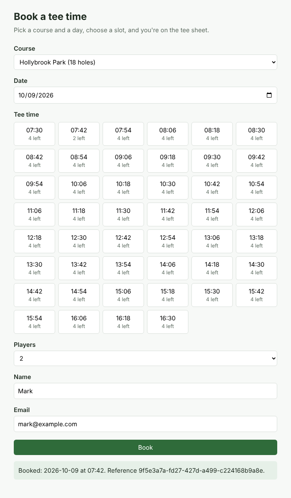

# Golf Booking System

A small tee-time booking app used as a vehicle for platform engineering: AWS infrastructure in **Terraform**, microservices on **Amazon EKS** deployed with **Helm**, and delivery through **GitHub Actions** and **Argo CD** (GitOps).

The app is deliberately simple. The platform around it is the point.



## Services

| Service | Does | Talks to |
| --- | --- | --- |
| `web` | Static booking page served by nginx | `/api/*` is routed to the APIs (by nginx locally, by the ALB on EKS) |
| `courses-api` | Courses and their tee sheets | Postgres (`courses` database) |
| `bookings-api` | Availability, create and cancel bookings | courses-api over HTTP, Postgres (`bookings` database), SQS |
| `notifications-worker` | Sends a confirmation for each `booking.created` event | SQS |

Every HTTP service exposes `/healthz` (liveness), `/readyz` (readiness, checks the database) and `/metrics` (Prometheus). The worker exposes metrics on port 8080.

### API

| Method and path | Result |
| --- | --- |
| `GET /api/courses` | All courses |
| `GET /api/courses/{id}/tee-times?date=YYYY-MM-DD` | The course's tee sheet for that day |
| `GET /api/bookings/availability?course_id=&date=` | Places left in each slot |
| `POST /api/bookings` | `201` booked, `409` slot full, `422` not a tee time, `404` unknown course, `400` past date |
| `GET /api/bookings/{id}` | One booking |
| `DELETE /api/bookings/{id}` | Cancel; the places become free again |

## Run it locally

Needs Docker and Python 3.12+.

```sh
make up        # build and start everything; open http://localhost:8080
make logs      # follow logs (watch the worker send confirmations)
make down      # stop and delete local data

make venv      # one virtualenv per service
make test      # unit tests for every service
make lint      # ruff lint and format check
```

Locally, Postgres stands in for RDS and [ElasticMQ](https://github.com/softwaremill/elasticmq) stands in for SQS. The services don't know the difference: boto3 is pointed at ElasticMQ with `AWS_ENDPOINT_URL`, which is simply unset on AWS.

## Layout

```
services/
  web/  courses-api/  bookings-api/  notifications-worker/
local/              # Postgres init script and ElasticMQ queue config for Compose
docs/adr/           # decision records: why things are the way they are
```

Terraform (`infra/`), the Helm chart (`charts/`) and CI workflows (`.github/workflows/`) arrive in later phases.

## Roadmap

| Phase | Focus | Status |
| --- | --- | --- |
| 0 | Local app, Docker Compose, tests | Done |
| 1 | Terraform bootstrap: state bucket, ECR, GitHub OIDC, budgets | Next |
| 2 | Terraform network, EKS and data modules | |
| 3 | Helm chart on a local kind cluster | |
| 4 | Running on EKS: ALB, Pod Identity, autoscaling | |
| 5 | GitHub Actions CI | |
| 6 | Argo CD GitOps | |
| 7 | Hardening (Karpenter, observability, canaries, policy) | |
| 8 | Portfolio polish | |

## Decisions

- [ADR 0001: Python and FastAPI for every service](docs/adr/0001-python-fastapi.md)
- [ADR 0002: A database per service on one Postgres instance](docs/adr/0002-database-per-service.md)
- [ADR 0003: Publish booking events after commit](docs/adr/0003-publish-after-commit.md)
